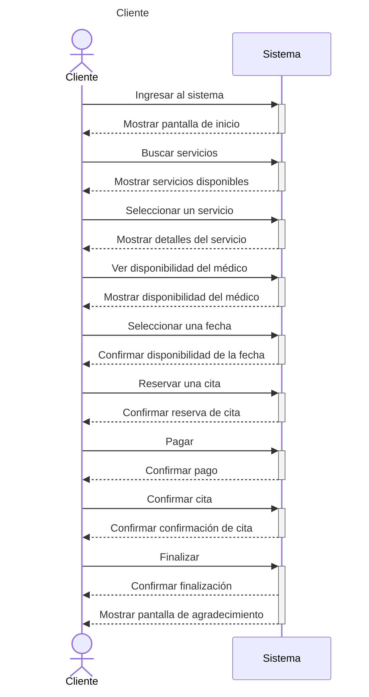
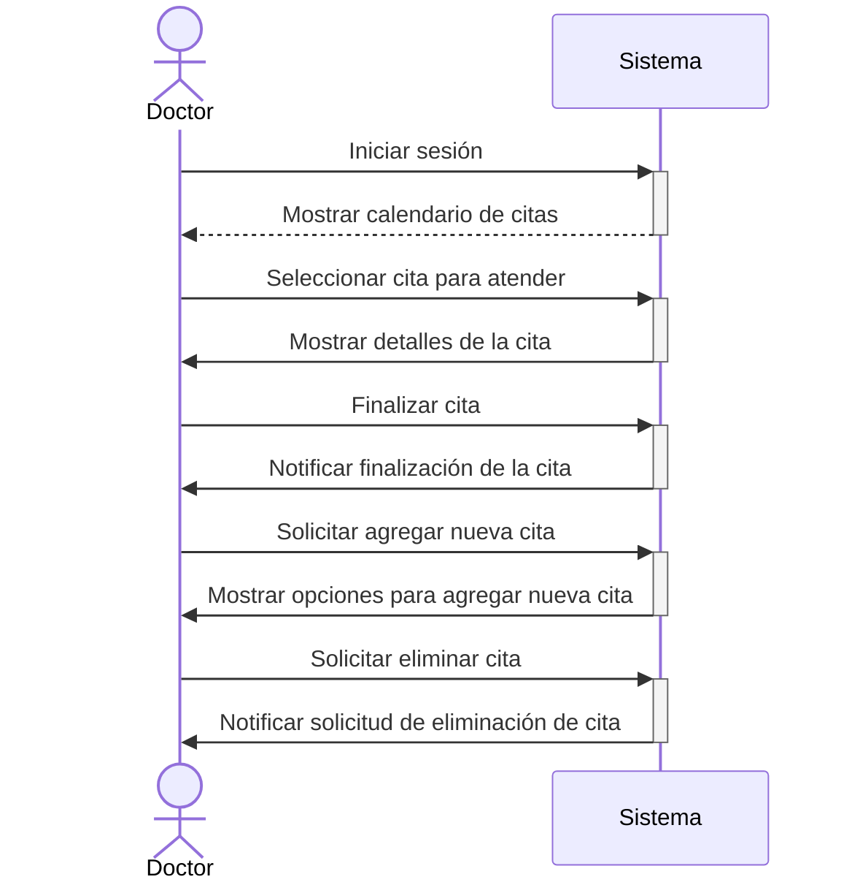
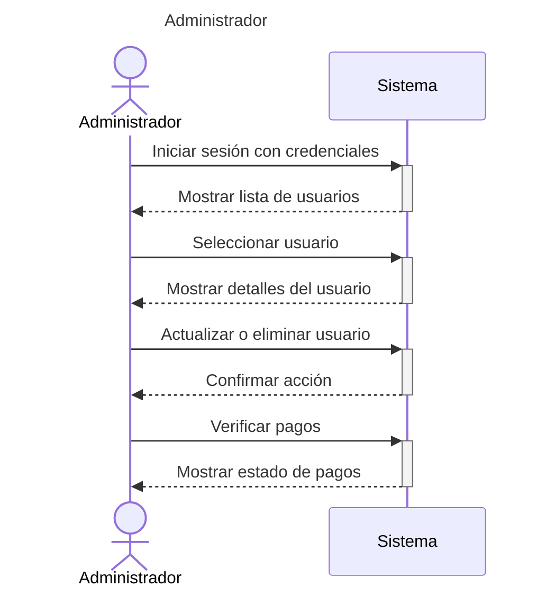
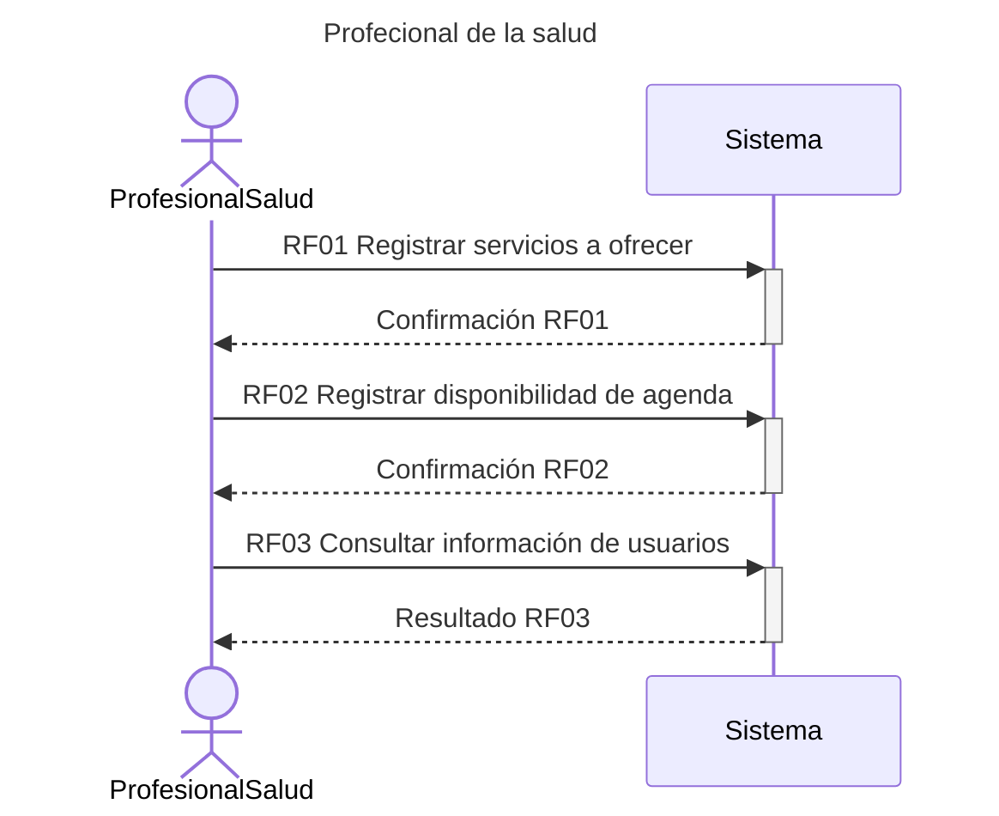
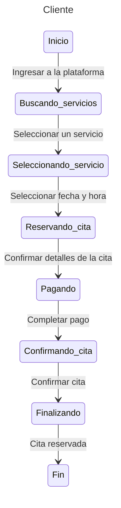
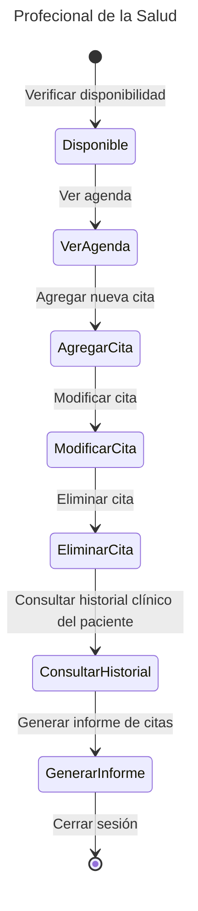
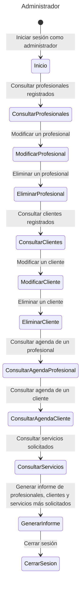

# Diagramas de Secuencias

## Cliente Diagrama





## Administrador Diagrama



## Profecional de la Salud Diagrama



# Diagrama  De estados

## Diagrama de Cliente







```teniendo en cuenta esto```Un sistema de reserva de citas médicas debe tener una serie de funcionalidades para cumplir con los requerimientos de los usuarios y mejorar la eficiencia y la experiencia del cliente. Aquí te presento algunas funcionalidades que podrías considerar:

Registro de citas y pacientes: Los usuarios deben poder crear, eliminar y modificar las citas de sus pacientes de manera rápida y sencilla 1.
Cita online: Los pacientes deben poder reservar sus citas directamente desde la web, lo que facilita el acceso y la comodidad para los usuarios 1.
Módulo de agendas: Los profesionales de la salud deben poder crear agendas para cada servicio, así como establecer diferentes permisos. Esto permite a los usuarios ver la disponibilidad de los profesionales y reservar citas en los horarios que les convengan 1.
Historiales médicos: Los sistemas deben permitir el almacenamiento y la consulta de los historiales médicos de los pacientes de manera segura 1.
Caja y facturación: Los sistemas deben ser capaces de generar facturas y presupuestos, y llevar al día toda la contabilidad de la clínica 1.
Análisis estratégicos: Los sistemas deben transformar todos los datos de la aplicación en información que sea útil para la toma de decisiones en la clínica 1.
Módulo de marketing: Los sistemas deben permitir la realización de campañas de mailing y fidelización de los clientes 1.
Gestión de la base de datos de pacientes: Los sistemas deben permitir el agregado automático de pacientes que reservan citas a la lista de pacientes, lo que facilita la administración y el seguimiento de los pacientes 2.
Recordatorios automáticos: Los sistemas deben ser capaces de enviar recordatorios automáticos a los pacientes para reducir la tasa de inasistencias 3.
Sistema de caja: Los sistemas deben permitir revisar el estado de las finanzas en tiempo real y sin errores 3.
Estas son solo algunas de las funcionalidades que podrías considerar para tu sistema de reserva de citas médicas. Recuerda que las necesidades específicas pueden variar dependiendo de los requerimientos de tu clínica o hospital.
quiero que tengas en cuenta el al celecionar la citas el medico debe mostrar en el sistema que dia tiene disponible  y el cliente debe saber cuendo el puede el debe seleccionar la fecha  

```
